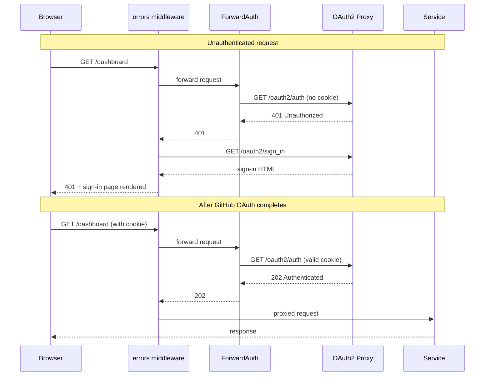
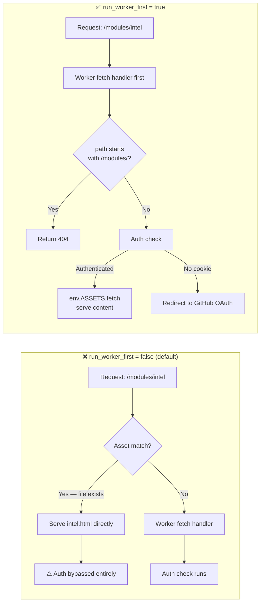

`console.kub0.io` was wide open. No login. No challenge. No door.

Grafana. DNS management. Kubernetes dashboard. File browser. Home automation. Seven services, seven ingresses, zero authentication. The VPN was the only perimeter — and VPNs are a single point of trust.

The cluster had [ears](https://jkubo.com/posts/every-thirty-seconds/), [eyes](https://jkubo.com/posts/the-all-seeing-eye/), and an [intelligence map](https://jkubo.com/posts/the-overwatch-map/) that combined them. It could listen to the sky and watch the roads. But it couldn't tell self from non-self. The body needed an immune system.

Three options: BasicAuth (UX from 1997, no sessions, no SSO), Tailscale ForwardAuth (elegant but dead end for public access), and OAuth2 Proxy (full GitHub OAuth, session cookies, multi-user). BasicAuth was dismissed in two sentences. Tailscale in one. OAuth2 Proxy it is.

## The ForwardAuth Wall

Deployed. Applied. Hit `console.kub0.io`.

`401 Unauthorized.`

No redirect. No login page. No GitHub. Just thirteen bytes of rejection.

```
10.42.1.0 - GET - "/oauth2/auth" HTTP/1.1 401 13
10.42.1.0 - GET - "/oauth2/auth" HTTP/1.1 401 13
```

ForwardAuth was working exactly as designed. It asked OAuth2 Proxy's `/oauth2/auth` endpoint: "Is this user authenticated?" No cookie. 401. Traefik faithfully returned the 401 to the browser. Done.

This is the gap between "authentication" and "authentication flow." OAuth2 Proxy has `/oauth2/sign_in` (login page), `/oauth2/start` (initiator), `/oauth2/callback` (handler). But `/oauth2/auth` — the endpoint ForwardAuth calls — only answers one question: authenticated? Yes is 202. No is 401. It doesn't start the flow. It doesn't redirect. It just answers.

Nginx Ingress Controller has `auth-signin` — an annotation that specifies where to redirect on failure. Traefik has no equivalent. The redirect is your problem.

### The Error Middleware Trick

Traefik's `errors` middleware intercepts HTTP responses by status code and replaces the body with content from a different service. Normally used for custom 404 pages. But nothing stops it from intercepting a 401.



```yaml
apiVersion: traefik.io/v1alpha1
kind: Middleware
metadata:
  name: oauth-errors
  namespace: networking
spec:
  errors:
    status:
      - "401-403"
    query: "/oauth2/sign_in"
    service:
      name: oauth2-proxy
      port: 4180
```

When ForwardAuth returns 401, the errors middleware catches it and fetches `/oauth2/sign_in` from OAuth2 Proxy. The browser renders the HTML — even on a 401, browsers render response bodies. The user clicks "Sign in with GitHub." The OAuth2 flow begins. Cookie set. Redirect to original URL. ForwardAuth checks again, finds a valid cookie, returns 202. Request proceeds.

The middleware chain on the ingress: errors first, then ForwardAuth.

```yaml
traefik.ingress.kubernetes.io/router.middlewares: >-
  networking-oauth-errors@kubernetescrd,
  networking-auth-console@kubernetescrd
```

Order matters. Requests flow inward: errors → auth → backend. Responses flow outward: backend → auth → errors. When auth returns 401 on the response path, errors intercepts it on the way out.

One detail that nearly caused an infinite loop: OAuth2 Proxy's own ingress — the one serving `/oauth2/*` routes — must NOT have ForwardAuth. If the sign-in page itself requires authentication, the browser bounces forever. The OAuth2 Proxy ingress is a separate resource with no middleware annotations. Authentication protects the portal. The authentication mechanism protects itself.


*The error middleware intercepts the 401 and serves this. The browser sees a login page. The cluster sees a successful error handler.*

## Two Proxies, Two Domains

The public door was locked. But now the internal doors looked embarrassingly open.

Six services on `kub0.xyz` had no authentication. If someone compromised a single Tailnet device, every admin panel was theirs. And the public proxy's `.kub0.io` cookie couldn't help — cookies are scoped by domain. A cookie set for `.kub0.io` is never sent to `.kub0.xyz`. The browser enforces this. Two domains, two trust boundaries, two authentication systems.

GitHub OAuth Apps support exactly one callback URL. Two domains need two apps:

| OAuth App | Callback | Cookie Domain | Protects |
|-----------|----------|---------------|----------|
| kub0.io Console | `console.kub0.io/oauth2/callback` | `.kub0.io` | Public portal, future `*.kub0.io` |
| kub0.xyz Internal | `eyes.kub0.xyz/oauth2/callback` | `.kub0.xyz` | Grafana, DNS, K8s dashboard, files, Home Assistant |

The internal proxy mirrors the public one — same image, same twelve-megabyte footprint — but with `--cookie-domain=.kub0.xyz`, `--cookie-name=_oauth2_proxy_internal`, and its own credentials from the vault. The leading dot means the cookie is valid across all subdomains. One login, entire domain. The cookie persists for seven days.

One annotation added to six ingress files. The same annotation, verbatim, on every one. Six doors, one lock pattern.

On a cluster where the DGX has 128GB of RAM, the entire auth layer — two pods, 24 megabytes total — is a rounding error.

## True SSO vs Gate Auth

For five of the six internal services, the OAuth2 gate is purely external. You prove who you are at the door, but the service behind the door doesn't know your name. Technitium still shows its own login. Home Assistant still wants its own credentials. The gate stops strangers. The service manages identity separately. Two logins.

Grafana is different. Grafana supports `auth.proxy` — a mode where it trusts an HTTP header to identify the user. OAuth2 Proxy already sets `X-Auth-Request-User` on every authenticated request. Grafana just needs to read it.

```yaml
grafana.ini:
  auth.proxy:
    enabled: true
    header_name: X-Auth-Request-User
    header_property: username
    auto_sign_up: true
  auth:
    disable_login_form: false
```

Four lines in the Helm values. `auto_sign_up: true` creates a user account on first visit. `disable_login_form: false` keeps the local admin login as a backdoor — if the proxy goes down, the admin password still works.

The immune system doesn't just check your badge — it tells the service who you are.

Both development services — JupyterLab at `jupyter.kub0.xyz` and Forgejo at `git.kub0.xyz` — sit behind the internal proxy. JupyterLab has its built-in token auth disabled; the OAuth2 gate is the single authority. Forgejo reads `X-Auth-Request-User` from the proxy header and auto-creates accounts — no Forgejo password, no second prompt.

## Four Tiers

The domain architecture maps to four trust levels:

| Tier | Domain | Access | Auth |
|------|--------|--------|------|
| Free Public | `intel.kub0.ai` (landing page) | Internet | None — `kub0.ai` redirects here |
| Authenticated Public | `intel.kub0.ai` (intelligence modules) | Internet | GitHub OAuth (Cloudflare Workers) |
| Authenticated Public | `console.kub0.io` | Cloudflare Tunnel | OAuth2 Proxy (`.kub0.io` cookie, kub0-io org) |
| Private | `kub0.xyz` | VPN only | OAuth2 Proxy (`.kub0.xyz` cookie) + VPN |

The private tier has defense-in-depth: you need VPN access *and* a valid GitHub session. Compromising one isn't enough. The VPN gets you to the door. The cookie gets you through it.

The two "Authenticated Public" tiers are different systems entirely — OAuth2 Proxy runs in the cluster mesh, while the intelligence map runs at the CDN edge with no mesh to proxy through. Same authentication concept. Completely different implementations. More on that below.

Public APIs at `api.kub0.io/adsb/*` and `api.kub0.io/cctv/*` remain unauthenticated. They're public data — aircraft positions and camera metadata, designed to be open. The immune system protects the organs, not the exhaled air.

## The Edge Guard

The cluster's immune system — two proxies, cookie domains, ForwardAuth middleware — protects everything running inside the Kubernetes mesh. Services inside the cluster can be protected because every request flows through Traefik. But the intelligence map lived somewhere Traefik couldn't reach.

`intel.kub0.ai` runs on Cloudflare Workers. It's not a pod. It has no sidecar. There's no OAuth2 Proxy to chain a ForwardAuth annotation to. The cluster's antibodies have no jurisdiction at the CDN edge.

So the map needed its own immune system.

The architecture is simpler than the cluster stack: a GitHub OAuth flow entirely inside the Worker, a D1 database for user records, and a KV namespace for sessions. When you visit `/overwatch`, the Worker checks your `__intel_session` cookie against KV. If it's there, you get the map. If not, you get GitHub's login page, and then you get the map. The cluster's OAuth2 Proxy never knows you exist.

Module HTML files live in a `modules/` directory that the Worker explicitly blocks — `path.startsWith('/modules/')` returns 404. Only the Worker itself, after verifying your session, serves the module content via the asset binding. The front door has a bouncer. The bouncer knows not to let anyone walk around back.

Or so I thought.

### The Private Browsing Test

Routine QA in a private browsing window. Navigate to `https://intel.kub0.ai/modules/intel` — and the full map loads. No login. No redirect. No bouncer. Just the map, in full, in a browser with no cookies.



The bypass was completely silent. No error in the Worker logs. No failed auth check. The map just appeared.

The diagnosis took an hour. The culprit was a single default: `run_worker_first = false`.

Cloudflare Workers Assets has two modes. In the default mode — assets first — if the requested URL matches a file in the assets directory, that file is served *directly*, before the Worker's `fetch()` handler ever runs. The Worker is an afterthought. The bouncer is behind the venue.

`modules/intel.html` was a file in the assets directory. A request for `/modules/intel` matched it. The file was served before the Worker could block it. The session check, the redirect, the entire auth system — skipped entirely.

The fix is one line in `wrangler.toml`:

```toml
[assets]
run_worker_first = true
```

Now every request goes to the Worker first. The asset binding becomes a tool the Worker uses deliberately, not an autonomous system routing around it.

One secondary gotcha: `env.ASSETS.fetch('/modules/intel.html')` returns a 307 redirect to `/modules/intel` — Cloudflare's automatic HTML URL cleaning. The Worker intercepts the redirect, sees `/modules/*`, and returns 404. The bouncer blocked its own boss. Fix: MODULE_PATHS uses clean paths without `.html` extensions — `env.ASSETS.fetch('/modules/intel')` serves content directly with no redirect in the chain.

OVERWATCH moved into the user dropdown while this was being settled — appearing only after sign-in, same position as the OPS CONSOLE link. No reason to advertise a door that won't open without a key.

### The Contextual Sign-In

The OPS CONSOLE link threads context forward: `console.kub0.io?from=intel&u=username`, where `username` comes from the auth status endpoint after login. The sign-in page reads `?u=` on load — if present, the button becomes "continue with GitHub (username)" rather than a generic prompt, with a "use a different account ↗" escape below. The Traefik error middleware serves the sign-in page in-place (no redirect, no referrer), so without the URL parameter there's no cross-origin signal to read. Two systems, one identity, no friction.

### The Unintended Performance Win

There's a secondary dividend from running auth at the edge rather than the cluster.

Every request to `api.kub0.io` — the cluster's public data surface — travels Cloudflare edge → cloudflared → Tailscale → Traefik → pod. The cloudflared deployment runs `--protocol=http2` by necessity: QUIC uses UDP port 7844, Tailscale is WireGuard over UDP, and UDP-in-UDP gets dropped. So the public API is HTTP/2 over TCP, constrained by the tunnel.

`intel.kub0.ai` has no Tailscale in the path at all. The Worker runs at the Cloudflare edge. Auth flows, session checks, asset delivery — none of it touches a node. The actual user-facing layer of the cluster runs QUIC end-to-end. The map loads faster than the API data it's rendering.

The cluster's immune system has a performance reflex. The antibodies live at the edge because they have to — but it turns out that's also where they're fastest.

## What You Can Do Once You're In

Authentication answers one question: are you who you say you are? Authorization answers a different one: so what?

The JupyterLab pod cleared the OAuth2 gate. Inside the container, a Claude Code session has access to a Python kernel, a persistent volume, and the cluster's AI assistant. It also had — until recently — no cluster permissions at all.

The pod runs as `system:serviceaccount:jupyter:default`. A default service account in Kubernetes is exactly what it sounds like: authenticated (the API server will accept its token), but bound to nothing. `kubectl get nodes` returns Forbidden. `kubectl get pods` returns Forbidden. A Claude Code session capable of managing the entire cluster was running blind, with no visibility into what was actually happening outside the container wall.

Two ClusterRoles close the gap:

- `jupyter-agent-reader`: cluster-wide reads on nodes, pods, deployments, services, ingresses, Flux resources, Traefik CRDs. Bound via ClusterRoleBinding — global visibility, nothing writable.
- `jupyter-agent-writer`: write access on deployments, services, configmaps, ingresses, CronJobs, Traefik middlewares. Bound per-namespace via RoleBindings — only `jupyter` and `networking`.

The separation is intentional. Agents need to *see* the full cluster — to know what nodes are available, what Flux is doing, whether a deployment is healthy. But they only need to *modify* the namespaces they work in. An agent working on the CCTV API deploys to `networking`. An agent working on JupyterLab deploys to `jupyter`. Neither can touch `flux-system`, `kube-system`, or anything outside their lane.

The node-level boundary is also intentional. Ansible stays on the host. K3s config, system packages, DRBD modules — those change the substrate the cluster runs on. Any issue tagged `scope:infra` routes to the human review queue. The RBAC is shaped around what agents are permitted to do autonomously. The things that could bring down three regions still require a human.

After the bindings were applied, from inside the prod JupyterLab pod:

```
$ kubectl get nodes
NAME             STATUS   ROLES                  AGE   VERSION
aus-ctrl-01      Ready    control-plane,etcd     16d   v1.34.3+k3s1
aus-fwd-gpu-01   Ready    <none>                 16d   v1.34.3+k3s1
...18 nodes total
```


*Full cluster visibility from inside a notebook cell. The agent can see everything running in the mesh — and write only to the namespaces it owns.*

### Per-Agent Identity

The shared service account is the floor. Every Claude Code session in JupyterLab authenticates as `jupyter:default` — same identity regardless of task, indistinguishable in the audit log if two run concurrently.

The [agent orchestrator](https://jkubo.com/posts/the-dispatcher/) fixes this at claim time. When an agent claims a task, the orchestrator creates a dedicated ServiceAccount — `agent-{issue-number}` — with RoleBindings in the relevant write namespaces and an 8-hour token via the TokenRequest API. The token arrives in the claim response. The agent uses its own identity rather than the pod's shared credentials.

On completion, the ServiceAccount is deleted — created for a task, destroyed with it. Two concurrent agents are genuinely distinct identities in the audit log. The orchestrator itself runs with a ClusterRole scoped to create and delete ServiceAccounts in the target namespaces only. A ward administrator who can issue and revoke badges, but only for the wards it oversees.

---

*The cluster has an immune system. Two proxies, two cookie domains, nine locked doors, one GitHub identity. Grafana recognizes you by name. Forgejo creates your account from a header. The notebook doesn't ask — the immune system already vouched for you.*

*The body knows self from non-self. And now it knows what each self is allowed to do.*
